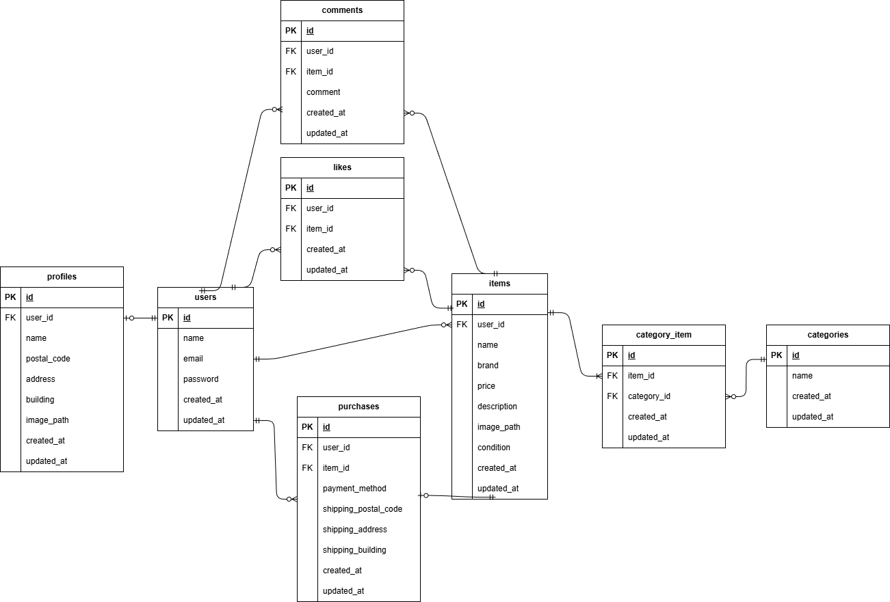

## アプリケーション名
coachtechフリマ

## 環境構築
```
リポジトリからダウンロード
git clone git@github.com:yurin0617/yurin-mogi1.git

ダウンロードしたディレクトリの中にあるsrcディレクトリにある
「.env.example」をコピーして「.env」を作成し DBの設定を変更
cp .env.example .env

DB_CONNECTION=mysql
DB_HOST=mysql
DB_PORT=3306
DB_DATABASE=laravel_db
DB_USERNAME=laravel_user
DB_PASSWORD=laravel_pass

dockerコンテナを構築
docker-compose up -d --build

phpコンテナにログインしてLaravelをインストール
docker-compose exec php bash
composer install

アプリケーションキーを作成
php artisan key:generate

DBのテーブルを作成
php artisan migrate

DBのテーブルにダミーデータを投入
php artisan db:seed

"The stream or file could not be opened"エラーが発生した場合
srcディレクトリにあるstorageディレクトリに権限を設定
chmod -R 777 storage

アップロードした画像をみれるようにするためシンボリックリンクを作成
php artisan storage:link
```
## テスト環境
てすとDB作成
.env.testingの作成
.php.artisantestの実行

## 使用技術(実行環境)
```
ここにバージョンを記載
```

## URL
```
ここにURLを記載
```

## ER図

